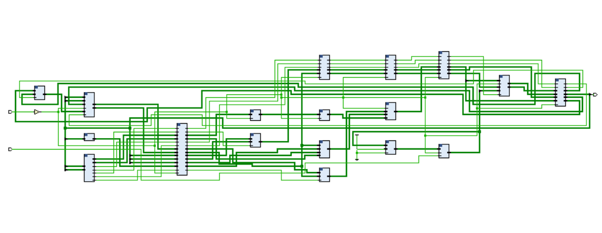

+++
# Date this page was created.
date = 2018-11-10T00:00:00
layout = "project"

# Project title.
title = "Pipelined CPU implemented on FPGA"

# Project summary to display on homepage.
summary = """
 This is the curriculum design for our computer achitecture course. 
 I'm responsible for the ALU and pipeline design
 """
 
# image_preview = "MIPS_CPU/FPGA.png"

# Tags: can be used for filtering projects.
# Example: `tags = ["machine-learning", "deep-learning"]`
tags = ["Programming","Hardware","CS"]

# Optional external URL for project (replaces project detail page).
external_link = ""

# [header]
# image = "MIPS_CPU/FPGA.png"

+++

# Overview
Based on gate-level circuit design, we implemented a 32 bits CPU in Verilog. It contains the main parts of a fully
functional pipelined CPU. Then we embedded deep pipeline into the ALU.  
We ran 100 8-point
FFT algorithm on it, And tested the project on FPGA (We used Basys, which is specifically designed for Vivado Design Suite). It is proved to be efficient 
and reliable.  

The main work for the project is as follows:  
1. The eight-staged pipelined CPU design and implementation, including the control part as well as data path.  
2. High efficiency assembly language of FFT.  
3. Hazard detection and the test of FFT on the simulated CPU.

# Main Module Design
## ALU (mainly on Multiplier)
We were required to implement gate-level Arithmetic Logical Unit (unlike behavior-level 
ALU, we were requested to implement the detail of the gates). When implementing it, we firstly designed
a simple unsigned multiplier based on the image below. 

And applied the operation of adding, shifting as well as choosing to implement the function of multiplying
by bits. Here are 32-bit analytical circuit and the waveform of simulation.

Then, to reduce the consumption of the resource, we connected the units based on the bits and cancelled the 
shifter. Meanwhile, we figured out in all the critical path included the multiplier. As a result, to 
improve the efficiency of our CPU, we add registers into the ALU along with the control unit.
## Datapath and Control
### Control
We had got all the units. But to make the CPU run smoothly, we still needed a control part. We used two decoders
to realize the functions. 

### Pipeline and Datapath
Pipelining is a technology that decomposes instructions into multiple steps and overlaps the steps of 
different instructions so that several instructions can be processed in parallel to speed up the process of
porgram running. Each step of the instructions has its own circuit parts to process, and each completed 
step moves to the next step, while the previous step handles the subsequent instructions.  
Overall, the pipeline is consisited of 5 parts, fetch, decode, execute, store as well as write back. But
we adjusted the structure and function of the RAMs, one of them could write and read at the same time, while
another one could only write or read at one time. The optimized datapath is shown below.

## Test
### FFT
### Test on FPGA

# Final Words
## Future Work
## Acknowledgement
It's really a great project, thank you for Prof. Jianhao Hu, Prof. Shang Ma and Associate Professor Jienan Chen, they provided us with amazing materials.
And it was a great time work with Zhongyao Cao and Sufang Yang, they both are young researchers and partners.

